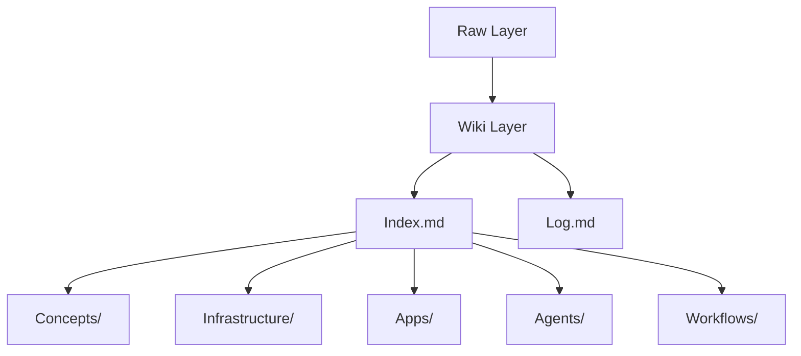

# Aiagentnerd Master Notes

# AiAgentNerd System Wiki: Technical Architecture & Implementation Guide

## System Architecture Overview

### Knowledge Layer Structure


**Key Components:**
1. **Raw Layer** (`raw/`)
   - Unprocessed source material
   - Subfolders: `web/`, `docs/`
   - File types: `.md`, `.txt`, `.html`

2. **Wiki Layer** (`wiki/`)
   - Structured knowledge repository
   - Core files: `index.md`, `log.md`
   - Subfolders: `concepts/`, `infrastructure/`, `apps/`, `agents/`, `workflows/`

### Version Control Integration
```bash
# Local Sync
cd "C:\Users\Win11\OneDrive\Documents\AIAgentNerd-Wiki"
git add .
git commit -m "Update: X Post App v2.1"
git push

# Server Sync
cd ~/aiagentnerd-wiki
git pull
```

## Technical Implementation Details

### Obsidian Wiki Setup
**Folder Structure:**
```
AIAgentNerd-Wiki/
├── raw/
│   ├── web/
│   └── docs/
└── wiki/
    ├── concepts/
    ├── infrastructure/
    ├── apps/
    ├── agents/
    └── workflows/
```

**Critical Files:**
- `index.md`: System navigation map
- `log.md`: Activity history
- `git-obsidian-setup.md`: Initial configuration guide

### Hermes Integration Protocol
**Memory Layer Architecture:**
1. **Core Memory** (`core-memory.md`)
   - Compact essentials (10-20 lines)
   - Examples: Server access, domain names, naming conventions

2. **Operating Rules** (`operating-rules.md`)
   - Agent roles definition
   - System conventions
   - Error handling protocols

3. **Wiki Retrieval** (Selective)
   - Priority: `wiki/` > `raw/`
   - Retrieval criteria:
     - Project-specific facts
     - System architecture
     - Workflow definitions

### Document Processing Pipeline
**Word File Integration:**
1. **Ingestion**
   ```bash
   # Convert .docx to .md
   pandoc input.docx -o raw/docs/tasknerd-business-plan.md
   ```

2. **Processing**
   - Manual review required
   - Structured conversion to wiki notes
   - Example transformation:
     ```markdown
     # Business Model
     ## Value Proposition
     - AI-powered content generation
     - Multi-agent workflow automation
     ```

3. **Version Control**
   - Header format:
     ```markdown
     # TaskNerd Business Plan
     ## Version v2.1 - Updated pricing model
     ## Last Updated 2026-04-16
     ```

## Workflow Automation

### Update Handling Protocol
**Update Workflow:**
1. Modify source file in Word
2. Update corresponding `raw/docs/` file
3. Trigger selective wiki updates:
   ```bash
   # Update specific wiki note
   git add wiki/concepts/business-model.md
   git commit -m "Update: Pricing model v2.1"
   git push
   ```

**Versioning Strategy:**
- Single file per document
- Version numbers in headers
- Git history for full audit trail

## Technical Decision Policies

**Memory Source Prioritization:**
1. Layer 1 (Core Memory) - Identity/Infrastructure
2. Layer 2 (Operating Rules) - System behavior
3. Layer 3 (Wiki) - Project knowledge
4. Layer 4 (Session Recall) - Historical context

**Retrieval Logic:**
```python
def get_memory_context(query):
    if query in core_facts:
        return layer1
    elif query in system_rules:
        return layer2
    elif query in wiki_knowledge:
        return layer3
    else:
        return layer4
```

## Implementation Best Practices

### File Management
- **Naming Convention:** `lowercase-with-hyphens.md`
- **Tagging System:**
  ```markdown
  #infrastructure #wiki #hermes
  ```
- **Linking Strategy:**
  ```markdown
  [[x-post-app]] [[nova]] [[openrouter]]
  ```

### System Maintenance
- **Daily Sync Routine:**
  ```bash
  #
